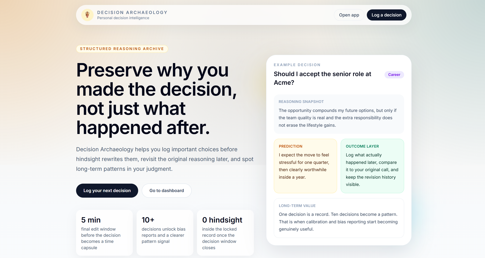

# Decision Archaeology

<p align="center">
  <a href="https://decision-archaeology.vercel.app/">
    
  </a>
</p>

Decision Archaeology is a structured personal decision intelligence platform for recording important decisions at the moment they are made, preserving the original reasoning, and revisiting outcomes over time. Instead of acting like a journal or to-do list, the app is designed as a time-locked archive of decision context: what you knew, what alternatives you considered, what you predicted, and why you chose one path over another.

Over time, the system turns individual decisions into a searchable personal knowledge base. Users can review their own thinking patterns, compare predictions against reality, track calibration, collaborate selectively on shared decisions, and generate AI-assisted reports that highlight recurring biases and assumptions.

## Product Preview



## What The Project Does

The application centers around a guided decision capture workflow.

- Users create a decision record using a structured multi-step form.
- Required fields enforce meaningful reflection rather than one-line notes.
- A time-capsule confirmation screen warns the user before the decision is finalized.
- After saving, core decision fields become locked after a 5-minute edit window.
- Later, users can add outcomes, supplementary notes, attachments, and typo-only correction requests without rewriting history.

The product also includes:

- Draft autosave and draft resume
- Archive search and structured filtering
- AI report generation and calibration tracking
- Attachments stored in Cloudflare R2
- Sharing and collaborator comments
- Export and import tools
- Onboarding helpers and milestone messaging

## Why It Exists

Most people remember the result of a decision, but not the reasoning that produced it. Once hindsight appears, the original context gets rewritten in memory. Decision Archaeology is built to preserve pre-hindsight reasoning so users can learn from the quality of their thinking, not only from the outcome.

This makes the product useful for:

- founders and operators reviewing strategic decisions
- professionals tracking career, finance, or health choices
- researchers building a structured archive of personal reasoning
- anyone who wants a durable record of how they think under uncertainty

## Current Project Status

This repository is beyond prototype stage and already contains a substantial working MVP. Core decision capture, locking, drafts, outcomes, collaboration, search, attachments, onboarding, export/import, and AI report plumbing are implemented. The project is suitable for local development and staging deployment, while some production-hardening concerns such as broader observability, compliance, stronger auth-tier parity, and full end-to-end hosted validation still remain.

## Core Product Flows

### 1. Decision Capture

The user creates a new decision through a guided multi-step form:

1. Basics
2. Reasoning
3. Optional context
4. Time-capsule confirmation
5. Saved state with lock countdown

Required fields:

- Decision Title
- Decision Summary
- Context
- Alternatives Considered
- Chosen Option
- Reasoning

Optional fields:

- Values at play
- Key uncertainties
- Predicted outcome
- Predicted timeframe
- Confidence level
- Domain tag
- Up to 5 custom tags
- Up to 5 attachments

### 2. Drafts

The form autosaves a draft approximately every 30 seconds. Drafts can be resumed from the decisions dashboard or reopened directly by URL. Finalizing a draft converts it into a proper decision record and starts the effective lock window from the finalization time.

### 3. Time Lock

Once a decision is finalized, the core fields are editable for 5 minutes. After that, the record becomes effectively locked on the server side. This protects the original reasoning from hindsight edits.

What stays editable after lock:

- supplementary notes
- outcome updates
- correction requests for typos

What does not remain editable:

- the original core reasoning fields

### 4. Outcomes

Users can attach one or more outcome updates to a decision over time. Each outcome includes:

- what happened
- outcome rating relative to expectation
- what the user would have done differently

This creates a revision history rather than replacing older updates.

### 5. Calibration And AI Reports

The app computes calibration from decisions that had a prediction and a closed outcome. It also supports AI-generated pattern reports that analyze decision history for biases and reasoning patterns, with user feedback loops for report quality.

### 6. Collaboration

A decision owner can share a record with collaborators. Collaborators can:

- view the shared record
- leave comments
- review outcome history
- request a check-in

Collaborators cannot modify or delete the original decision.

### 7. Import And Export

Users can export records in portable formats and import historical data using templates. Imported decisions are marked as imported and are not treated like fresh time-locked entries.

## Tech Stack

### Frontend

- Next.js 16 App Router
- React 19
- TypeScript
- Tailwind CSS 4

### Backend And Data

- Next.js route handlers
- Prisma ORM
- PostgreSQL
- `pg` driver
- Prisma Postgres adapter

### Auth

- Clerk

### Storage And Jobs

- Cloudflare R2 for attachments
- Upstash QStash for background/job-style flows
- Upstash Redis support is present for future/runtime expansion

### AI And Communication

- NVIDIA NIM
- Mistral
- OpenAI SDK client utilities present in the codebase
- Resend for email
- Svix for Clerk webhook verification

### Testing And Quality

- Vitest
- Testing Library
- ESLint
- Prettier

## Repository Structure

The most important folders:

- [`src/app`](/c:/Users/Munna/Documents/GitSync/decision-archaeology/src/app): App Router pages, layouts, and API route handlers
- [`src/components`](/c:/Users/Munna/Documents/GitSync/decision-archaeology/src/components): UI and product feature components
- [`src/lib`](/c:/Users/Munna/Documents/GitSync/decision-archaeology/src/lib): shared business logic, integrations, validation, and utilities
- [`src/__tests__`](/c:/Users/Munna/Documents/GitSync/decision-archaeology/src/__tests__): unit and integration-style tests
- [`prisma`](/c:/Users/Munna/Documents/GitSync/decision-archaeology/prisma): schema and database definitions
- [`docs`](/c:/Users/Munna/Documents/GitSync/decision-archaeology/docs): deployment and supporting docs

## Key Routes

Public routes:

- `/`
- `/sign-in`
- `/sign-up`

Core app routes:

- `/decisions`
- `/decisions/new`
- `/decisions/[id]`
- `/calibration`
- `/ai/reports`
- `/shared/[shareId]`

Key API groups:

- `/api/decisions`
- `/api/decisions/[id]`
- `/api/decisions/[id]/attachments`
- `/api/decisions/[id]/outcomes`
- `/api/decisions/[id]/corrections`
- `/api/ai/reports`
- `/api/calibration`
- `/api/webhooks/clerk`

## How The System Works

### Authentication

Clerk handles sign-in, sign-up, sessions, and protected routes. Once a Clerk user is created or updated, the webhook endpoint syncs the user into the app database. Most app logic depends on that database user record existing, so webhook health is important for deployed environments.

### Database Layer

Prisma is the main ORM. The app uses a PostgreSQL-backed Prisma client configured with the Prisma Postgres adapter. User records, decision records, outcomes, attachments, reports, shares, and correction requests are all modeled in the Prisma schema.

### Validation

Input is validated with Zod before database writes. This covers:

- decision creation
- draft saving
- draft finalization
- notes updates
- correction requests
- imports and other structured inputs

### Time Lock Enforcement

The lock is not only a frontend timer. The frontend shows the countdown, but the server is the real source of truth. Once the edit window expires, protected routes reject core-field mutations.

### Attachments

Attachments are uploaded against a specific decision and stored in Cloudflare R2 through an S3-compatible API. The app validates file count and size rules before accepting them.

### AI Reporting

Report generation is gated by data thresholds so the model does not analyze too little history. AI outputs are treated as probabilistic assistance, not certainty. The system also includes user feedback paths for incorrect report findings.

## Local Development

### Prerequisites

Install:

- Node.js 20+
- npm
- PostgreSQL database
- Clerk app credentials
- optional but recommended service credentials for AI, email, jobs, and attachments

### 1. Install Dependencies

```bash
npm install
```

### 2. Create Environment Variables

Use `.env.local` for local development. The project also includes an `.env.example` template.

Important variables used by the current app:

```env
NEXT_PUBLIC_CLERK_PUBLISHABLE_KEY=
CLERK_SECRET_KEY=
CLERK_WEBHOOK_SECRET=
DATABASE_URL=
NEXT_PUBLIC_APP_URL=http://localhost:3000

NVIDIA_API_KEY=
MISTRAL_API_KEY=

RESEND_API_KEY=
RESEND_FROM_EMAIL=

QSTASH_TOKEN=
QSTASH_CURRENT_SIGNING_KEY=
QSTASH_NEXT_SIGNING_KEY=

R2_ACCESS_KEY_ID=
R2_SECRET_ACCESS_KEY=
R2_ENDPOINT_URL=
R2_BUCKET_NAME=
R2_PUBLIC_URL=
```

Notes:

- Only variables beginning with `NEXT_PUBLIC_` are exposed to the browser.
- For local development, keep secrets in `.env.local`.
- For Vercel or any hosting platform, set these in the platform environment settings instead of committing secrets.

### 3. Prepare The Database

If this is your first setup:

```bash
npx prisma generate
npx prisma db push
```

If you are using migrations:

```bash
npx prisma migrate deploy
```

Useful Prisma commands:

```bash
npx prisma studio
npx prisma validate
```

### 4. Run The App

```bash
npm run dev
```

Then open:

- `http://localhost:3000`

### 5. Run Checks

```bash
npm test
npm run lint
npm run build
```

## Beginner Walkthrough

If you are new to the codebase, this is the fastest way to understand it.

### Step 1. Start At The Product Surface

Open:

- [`src/app/page.tsx`](/c:/Users/Munna/Documents/GitSync/decision-archaeology/src/app/page.tsx)
- [`src/app/(dashboard)/decisions/page.tsx`](/c:/Users/Munna/Documents/GitSync/decision-archaeology/src/app/(dashboard)/decisions/page.tsx)
- [`src/app/(dashboard)/decisions/new/page.tsx`](/c:/Users/Munna/Documents/GitSync/decision-archaeology/src/app/(dashboard)/decisions/new/page.tsx)

This shows the public landing page, the main archive view, and the entry point into the capture flow.

### Step 2. Understand The Main Form

Open:

- [`src/components/decisions/DecisionCaptureForm.tsx`](/c:/Users/Munna/Documents/GitSync/decision-archaeology/src/components/decisions/DecisionCaptureForm.tsx)

This is one of the most important files in the project. It handles:

- multi-step capture
- validation handoff
- autosave
- draft resume
- submission
- post-save transition into the lock window

### Step 3. Follow The API

Open:

- [`src/app/api/decisions/route.ts`](/c:/Users/Munna/Documents/GitSync/decision-archaeology/src/app/api/decisions/route.ts)
- [`src/app/api/decisions/[id]/route.ts`](/c:/Users/Munna/Documents/GitSync/decision-archaeology/src/app/api/decisions/[id]/route.ts)

This shows how the app:

- creates decisions
- stores drafts
- finalizes drafts
- updates notes
- enforces lock rules

### Step 4. Read Shared Logic

Open:

- [`src/lib/decisions.ts`](/c:/Users/Munna/Documents/GitSync/decision-archaeology/src/lib/decisions.ts)
- [`src/lib/locks.ts`](/c:/Users/Munna/Documents/GitSync/decision-archaeology/src/lib/locks.ts)
- [`src/lib/prisma.ts`](/c:/Users/Munna/Documents/GitSync/decision-archaeology/src/lib/prisma.ts)
- [`src/lib/validations/decision.ts`](/c:/Users/Munna/Documents/GitSync/decision-archaeology/src/lib/validations/decision.ts)

This is where the core domain logic lives.

### Step 5. Check Supporting Features

Then explore:

- attachments
- corrections
- outcomes
- AI reports
- sharing
- onboarding

Useful files:

- [`src/components/decisions/AttachmentManager.tsx`](/c:/Users/Munna/Documents/GitSync/decision-archaeology/src/components/decisions/AttachmentManager.tsx)
- [`src/components/decisions/OutcomeHistory.tsx`](/c:/Users/Munna/Documents/GitSync/decision-archaeology/src/components/decisions/OutcomeHistory.tsx)
- [`src/components/decisions/DecisionDetail.tsx`](/c:/Users/Munna/Documents/GitSync/decision-archaeology/src/components/decisions/DecisionDetail.tsx)
- [`src/app/api/ai/reports/route.ts`](/c:/Users/Munna/Documents/GitSync/decision-archaeology/src/app/api/ai/reports/route.ts)

## Deployment

This app is set up primarily with Vercel in mind.

Recommended deployment flow:

1. push the latest code to GitHub
2. import the repo into Vercel
3. add the required environment variables
4. set `NEXT_PUBLIC_APP_URL` to the deployed domain
5. configure Clerk webhook to `/api/webhooks/clerk`
6. apply the production database schema
7. run a full smoke test

Detailed deployment notes are in:

- [`docs/VERCEL_DEPLOYMENT.md`](/c:/Users/Munna/Documents/GitSync/decision-archaeology/docs/VERCEL_DEPLOYMENT.md)

## Hosted Smoke Test Checklist

After deploying, test these flows in order:

1. Sign in / sign up
2. Confirm Clerk webhook creates the database user
3. Create a draft
4. Finalize a decision
5. Wait for or verify lock behavior
6. Add an attachment
7. Add an outcome
8. Open calibration
9. Generate an AI report
10. Share a decision
11. Open the collaborator view
12. Export and import data

## Common Problems And Fixes

### Sign-in Works But The App Fails After Login

Likely causes:

- Clerk webhook is disabled
- `CLERK_WEBHOOK_SECRET` is wrong
- database schema is not applied
- `DATABASE_URL` is missing or invalid

Check:

- `/api/webhooks/clerk`
- Vercel function logs
- database migration state

### Clicking "Lock It In" Appears To Do Nothing

Likely causes:

- the live deployment is on an older build
- the create decision API is failing
- the database user was never synced from Clerk

Check:

- latest deployment includes the newest commits
- browser UI now shows save errors on the confirm step
- `/api/decisions` function logs

### Webhook Fails In Production

Common reasons:

- wrong signing secret
- wrong webhook URL
- missing `DATABASE_URL`
- database tables not created yet

### Attachments Fail

Check:

- `R2_ACCESS_KEY_ID`
- `R2_SECRET_ACCESS_KEY`
- `R2_ENDPOINT_URL`
- `R2_BUCKET_NAME`

## Testing Philosophy

This repository currently leans on local test/build confidence plus manual product validation. The test suite covers important validation and business logic, but it is not yet a full end-to-end safety net for every hosted workflow. For that reason, local checks and staged smoke tests are both important.

## Scripts

```bash
npm run dev
npm run build
npm run start
npm run lint
npm test
npm run test:watch
```

## Roadmap Areas Still Worth Hardening

Major areas still open for deeper production readiness:

- stronger deployment and webhook reliability checks
- broader end-to-end tests
- billing and tier UX polish
- settings and account management depth
- security, compliance, and encryption hardening
- mobile/offline support
- more mature observability

## Contributing

If you are extending this project:

- keep business rules server-enforced
- prefer incremental, logically scoped commits
- validate schema changes carefully
- run `npm test`, `npm run lint`, and `npm run build` before shipping
- avoid weakening the time-lock model, because it is a core product principle

## License

No license has been declared yet. Treat the repository as private/internal unless a formal license is added.
